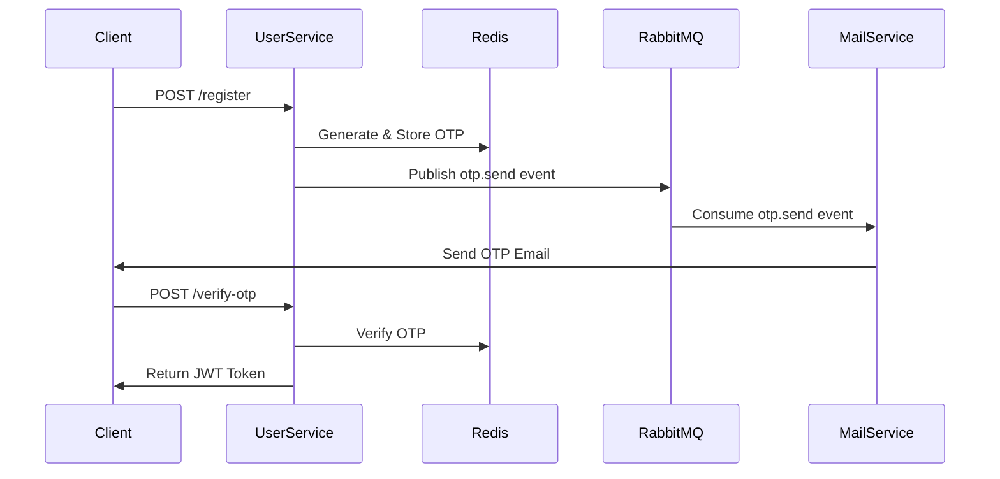

# 🚀 Real-Time Chat Application

<div align="center">


*A scalable, event-driven chat application built with microservices architecture*

[Features](#-features) • [Architecture](#-architecture) • [Getting Started](#-getting-started) • [API Documentation](#-api-documentation) • [Contributing](#-contributing)

</div>

---

## 📋 Table of Contents

- [Overview](#-overview)
- [Features](#-features)
- [Architecture](#-architecture)
- [Tech Stack](#-tech-stack)
- [Getting Started](#-getting-started)
- [Services](#-services)
- [Environment Variables](#-environment-variables)
- [API Documentation](#-api-documentation)
- [Message Queue Events](#-message-queue-events)
- [Contributing](#-contributing)
- [License](#-license)

---

## 🎯 Overview

This is a modern, scalable chat application built using microservices architecture. The application is designed to handle real-time messaging, user authentication, and email notifications efficiently through distributed services communicating via RabbitMQ message broker.

---

## ✨ Features

- 🔐 **Secure Authentication** - OTP-based authentication with Redis caching
- 💬 **Real-time Messaging** - Instant message delivery across services
- 📧 **Email Notifications** - Automated email service for OTPs and notifications
- 🔄 **Event-Driven Architecture** - Asynchronous communication via RabbitMQ
- ⚡ **High Performance** - Redis caching for optimal response times
- 🎨 **RESTful APIs** - Clean and documented API endpoints
- 📊 **Scalable Design** - Independent services that can scale horizontally
- 🛡️ **Error Handling** - Robust error handling and logging

---

## 🏗️ Architecture

```
┌─────────────────────────────────────────────────────────────┐
│                         API Gateway                          │
└─────────────────────────────────────────────────────────────┘
                              │
        ┌─────────────────────┼─────────────────────┐
        │                     │                     │
┌───────▼────────┐   ┌────────▼────────┐   ┌───────▼────────┐
│  User Service  │   │  Chat Service   │   │  Mail Service  │
│                │   │                 │   │                │
│  • Auth        │   │  • Messages     │   │  • OTP Emails  │
│  • Profile     │   │  • Rooms        │   │  • Notifs      │
│  • OTP         │   │  • WebSocket    │   │  • Templates   │
└────────┬───────┘   └────────┬────────┘   └────────┬───────┘
         │                    │                      │
         └────────────────────┼──────────────────────┘
                              │
                    ┌─────────▼─────────┐
                    │     RabbitMQ      │
                    │  Message Broker   │
                    └───────────────────┘
                              │
                    ┌─────────┴─────────┐
                    │                   │
            ┌───────▼───────┐   ┌───────▼───────┐
            │     Redis     │   │   Database    │
            │               │   │               │
            │  • OTP Cache  │   │  • Users      │
            │  • Sessions   │   │  • Messages   │
            │  • Rate Limit │   │  • Rooms      │
            └───────────────┘   └───────────────┘
```

### Architecture Principles

- **Loose Coupling**: Services communicate through message queues
- **High Cohesion**: Each service handles a specific domain
- **Fault Tolerance**: Services can fail independently
- **Scalability**: Services can be scaled based on demand

---

## 🛠️ Tech Stack

| Category | Technology |
|----------|-----------|
| **Runtime** | Node.js |
| **Message Broker** | RabbitMQ |
| **Cache & Session** | Redis |
| **Database** | MongoDB / PostgreSQL |
| **Real-time** | Socket.io |
| **Authentication** | JWT + OTP |
| **Email** | Nodemailer |

---

## 🚀 Getting Started

### Prerequisites

- Node.js (v16 or higher)
- Docker & Docker Compose
- Redis (v6 or higher)
- RabbitMQ (v3.9 or higher)

### Installation

1. **Clone the repository**
   ```bash
   git clone https://github.com/yourusername/chat-app.git
   cd chat-app
   ```

2. **Install dependencies for all services**
   ```bash
   # Install dependencies for each service
   cd services/user-service && npm install
   cd ../chat-service && npm install
   cd ../mail-service && npm install
   cd ../..
   ```

3. **Set up environment variables**
   ```bash
   # Copy example env files
   cp services/user-service/.env.example services/user-service/.env
   cp services/chat-service/.env.example services/chat-service/.env
   cp services/mail-service/.env.example services/mail-service/.env
   ```

4. **Start infrastructure services with Docker**
   ```bash
   docker-compose up -d
   ```

5. **Run the microservices**
   ```bash
   # Terminal 1 - User Service
   cd services/user-service && npm run dev

   # Terminal 2 - Chat Service
   cd services/chat-service && npm run dev

   # Terminal 3 - Mail Service
   cd services/mail-service && npm run dev
   ```

### Quick Start with Docker Compose

```bash
docker-compose up --build
```

This will start all services including RabbitMQ, Redis, and the microservices.

---

## 🔧 Services

### 1. User Service (Port: 3001)

Manages user authentication, profiles, and OTP generation.

**Responsibilities:**
- User registration and login
- OTP generation and verification
- Profile management
- JWT token generation

**Key Endpoints:**
- `POST /api/users/register` - Register new user
- `POST /api/users/login` - User login
- `POST /api/users/verify-otp` - Verify OTP
- `GET /api/users/profile` - Get user profile

### 2. Chat Service (Port: 3002)

Handles real-time messaging and chat rooms.

**Responsibilities:**
- Message creation and retrieval
- Chat room management
- WebSocket connections
- Message broadcasting

**Key Endpoints:**
- `POST /api/chats/rooms` - Create chat room
- `GET /api/chats/rooms/:id/messages` - Get messages
- `POST /api/chats/messages` - Send message
- `WS /socket.io` - WebSocket connection

### 3. Mail Service (Port: 3003)

Manages email sending for OTPs and notifications.

**Responsibilities:**
- OTP email delivery
- Notification emails
- Email templates
- Email queue processing

**Key Events:**
- `user.otp.send` - Send OTP email
- `user.registered` - Welcome email
- `chat.notification` - Chat notifications

---

## 🔐 Environment Variables

### User Service (.env)
```env
PORT=3001
NODE_ENV=development
DATABASE_URL=mongodb://localhost:27017/chat-users
REDIS_URL=redis://localhost:6379
RABBITMQ_URL=amqp://localhost:5672
JWT_SECRET=your-secret-key
OTP_EXPIRY=300
```

### Chat Service (.env)
```env
PORT=3002
NODE_ENV=development
DATABASE_URL=mongodb://localhost:27017/chat-messages
REDIS_URL=redis://localhost:6379
RABBITMQ_URL=amqp://localhost:5672
```

### Mail Service (.env)
```env
PORT=3003
NODE_ENV=development
RABBITMQ_URL=amqp://localhost:5672
SMTP_HOST=smtp.gmail.com
SMTP_PORT=587
SMTP_USER=your-email@gmail.com
SMTP_PASSWORD=your-app-password
FROM_EMAIL=noreply@chatapp.com
```

---

## 📡 API Documentation

### Authentication Flow



### Sample API Requests

**Register User**
```bash
curl -X POST http://localhost:3001/api/users/register \
  -H "Content-Type: application/json" \
  -d '{
    "email": "user@example.com",
    "username": "johndoe",
    "password": "securePassword123"
  }'
```

**Send Message**
```bash
curl -X POST http://localhost:3002/api/chats/messages \
  -H "Content-Type: application/json" \
  -H "Authorization: Bearer YOUR_JWT_TOKEN" \
  -d '{
    "roomId": "room123",
    "message": "Hello, World!"
  }'
```

---

## 📨 Message Queue Events

### Published Events

| Event | Publisher | Payload | Description |
|-------|-----------|---------|-------------|
| `user.otp.send` | User Service | `{ email, otp, username }` | Send OTP to user |
| `user.registered` | User Service | `{ email, username }` | Welcome new user |
| `message.sent` | Chat Service | `{ roomId, message, userId }` | New message notification |
| `user.online` | Chat Service | `{ userId, socketId }` | User online status |

### Consumed Events

| Event | Consumer | Action |
|-------|----------|--------|
| `user.otp.send` | Mail Service | Send OTP email |
| `user.registered` | Mail Service | Send welcome email |
| `message.sent` | Mail Service | Send message notification |

---

## 🧪 Testing

```bash
# Run tests for all services
npm run test

# Run tests for specific service
cd services/user-service && npm test

# Run integration tests
npm run test:integration

# Run with coverage
npm run test:coverage
```

---

## 📦 Project Structure

```
chat-app/
├── services/
│   ├── user-service/
│   │   ├── src/
│   │   │   ├── controllers/
│   │   │   ├── models/
│   │   │   ├── routes/
│   │   │   ├── services/
│   │   │   ├── middlewares/
│   │   │   └── utils/
│   │   ├── tests/
│   │   └── package.json
│   │
│   ├── chat-service/
│   │   ├── src/
│   │   │   ├── controllers/
│   │   │   ├── models/
│   │   │   ├── routes/
│   │   │   ├── socket/
│   │   │   └── services/
│   │   └── package.json
│   │
│   └── mail-service/
│       ├── src/
│       │   ├── consumers/
│       │   ├── templates/
│       │   └── services/
│       └── package.json
│
├── docker-compose.yml
├── .gitignore
└── README.md
```

---

## 🤝 Contributing

Contributions are welcome! Please follow these steps:

1. Fork the repository
2. Create a feature branch (`git checkout -b feature/AmazingFeature`)
3. Commit your changes (`git commit -m 'Add some AmazingFeature'`)
4. Push to the branch (`git push origin feature/AmazingFeature`)
5. Open a Pull Request

### Coding Standards

- Follow ESLint configuration
- Write unit tests for new features
- Update documentation for API changes
- Use conventional commits

---

## 📄 License

This project is licensed under the MIT License - see the [LICENSE](LICENSE) file for details.

---

## 👥 Authors

- **Your Name** - *Initial work* - [YourGithub](https://github.com/yourusername)

---

## 🙏 Acknowledgments

- RabbitMQ for reliable message queuing
- Redis for high-performance caching
- Socket.io for real-time communication
- The Node.js community

---

## 📞 Support

For support, email support@chatapp.com or join our Slack channel.

---

<div align="center">

Made with ❤️ by Your Team

⭐ Star us on GitHub — it motivates us a lot!

</div>
